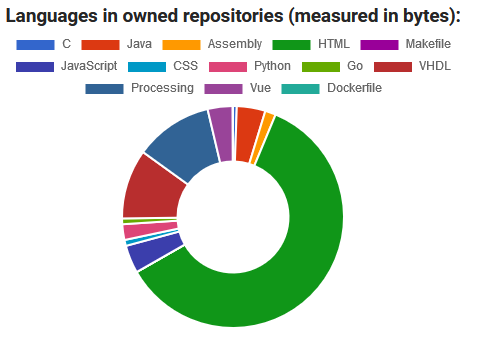
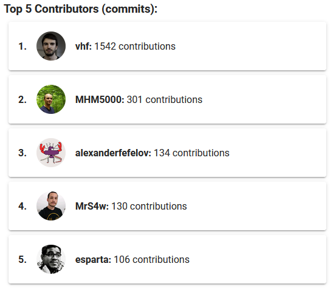
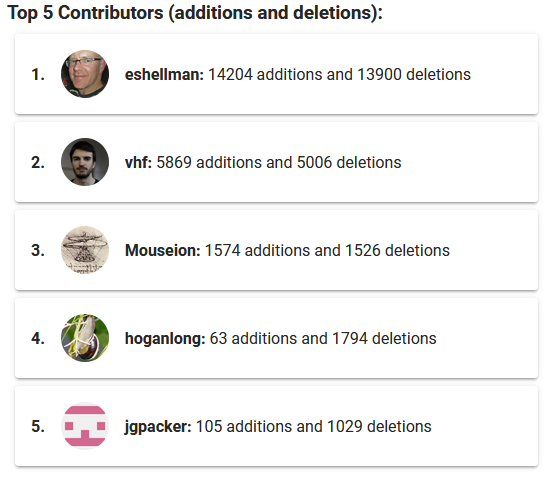

# Github-Visualiser
#### A web-application that interrogates the Github API and visualises data about the software engineering process.

## Table of Contents
1. [Prerequisites](#prerequisites)
2. [Running the Project](#running-the-project)
3. [Project Explanation](#explanation)
4. [Project Breakdown](#project-breakdown)  
&nbsp;&nbsp;&nbsp;&nbsp;&nbsp;&nbsp;a. [Search Fucntionality](#the-search-functionality)  
&nbsp;&nbsp;&nbsp;&nbsp;&nbsp;&nbsp;b. [User Section](#the-user-section---graphs-and-example)  
&nbsp;&nbsp;&nbsp;&nbsp;&nbsp;&nbsp;c. [Repository Section](#the-repositories-section---graph-lists-and-example)
5. [Hero Rating](#hero-rating)

## Prerequisites
To run this project, you will need the following installed:

- Docker

## Running the Project
Navigate to the `github-visualiser` folder and run the following terminal commands:

```
docker build -t <your_image_name> .
docker run -it -p 8080:8080 --rm <your_image_name>
```
The docker container is now running, and the project should be accessible on `localhost:8080`.

## Project Explanation
This project was created for an assignment in the CSU33012 Software Engineering module in Trinity College Dublin. This
assignment asked students to create an application that interrogates the Github API and builds a visualisation of the data
available that elucidates some aspect of the software engineering process. The focus of this project is to evaluate the
performance of software engineers in three contexts:

1. In the context of the individual software engineer.
2. In the context of collaborative projects.
3. In the context of github organisations.

This web-application allows users to search Github accounts, Github repositories and Github organisations and
displays relevant information in various graphs, as well as providing an evaluation of the performance of the 
individual software engineers within these contexts.

## Project Breakdown
### The Search Functionality
The search bar appears at the top of the application and allows users to search github accounts, repositories and organisations.


### The User Section - Graphs and Example
Here are the graphs that appear in the user section, as well as an example of what the full user section looks like:  
#### A card which evaluates the user's Github performance in the year 2020:  

#### A pie chart showing what programming languages can be found in the user's owned repositories:  

#### A pie chart showing the amount of commits in the user's owned repositories:  

#### A bar chart showing recent user commits:  

#### A heat map showing commits over the year 2020:  

#### Links to search the user's repositories:  

#### Here is an example of a successfully searched user's page:


### The Repositories Section - Graph, Lists and Example
Here is the graph that appears in the repositories section, as well as an example of what the full repository section looks like:
#### A line graph that shows commits by contributors over time:  
  
#### A list of the top 5 contributors determined by commits:  

#### A list of the top 5 contributors determined by additions and deletions:  
  
#### A list of the top 5 commenters:  
  
#### A card showing the three repository heroes (see [Hero Rating](#hero-rating))  
  
#### Links to search contributors:  

#### Here is an example of a successfully searched repository's page:  


## Hero Rating


