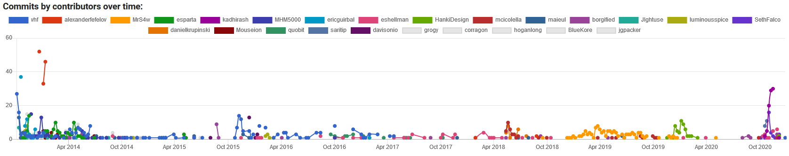

# Github-Visualiser
#### A web-application that interrogates the Github API and visualises data about the software engineering process.

## Table of Contents
1. [Prerequisites](#prerequisites)
2. [Running the Project](#running-the-project)
3. [Project Explanation](#project-explanation)
4. [Project Breakdown](#project-breakdown)  
&nbsp;&nbsp;&nbsp;&nbsp;&nbsp;&nbsp;a. [Search Fucntionality](#the-search-functionality)  
&nbsp;&nbsp;&nbsp;&nbsp;&nbsp;&nbsp;b. [User Section](#the-user-section---graphs-and-example)  
&nbsp;&nbsp;&nbsp;&nbsp;&nbsp;&nbsp;c. [Repository Section](#the-repositories-section---graph-lists-and-example)  
&nbsp;&nbsp;&nbsp;&nbsp;&nbsp;&nbsp;c. [Organisation Section](#the-organisatios-section---graphs-list-and-example)
5. [Hero Rating](#hero-rating)
6. [Examples](#examples)

## Prerequisites
To run this project, you will need the following:
- Docker
- A GitHub Personal Access Token

## Running the Project
Navigate to the `github-visualiser` folder. In the `Dockerfile`, add your Github Personal Access to the third line, where it says:  
```
ENV VUE_APP_API_KEY <INSERT_YOUR_PERSONAL_ACCESS_TOKEN_HERE>
```
Now run the following terminal commands:
```
docker build -t <your_image_name> .
docker run -it -p 8080:8080 --rm <your_image_name>
```
The docker container is now running, and the project should be accessible on `localhost:8080`.

## Project Explanation
This project was created for an assignment in the CSU33012 Software Engineering module in Trinity College Dublin. This
assignment asked students to create an application that interrogates the Github API and builds a visualisation of the data
available that elucidates some aspect of the software engineering process. The focus of this project is to evaluate the
performance of software engineers in three contexts:

1. In the context of the individual software engineer.
2. In the context of collaborative projects.
3. In the context of github organisations.

This web-application allows users to search Github accounts, Github repositories and Github organisations and
displays relevant information in various graphs, as well as providing an evaluation of the performance of the 
individual software engineers within these contexts.

## Project Breakdown
### The Search Functionality
The search bar appears at the top of the application and allows users to search github accounts, repositories and organisations.


### The User Section - Graphs and Example
Here are the graphs that appear in the user section, as well as an example of what the full user section looks like:  
#### A card which evaluates the user's Github performance in the year 2020:  

#### A pie chart showing what programming languages can be found in the user's owned repositories:  

#### A pie chart showing the amount of commits in the user's owned repositories:  

#### A bar chart showing recent user commits:  

#### A heat map showing commits over the year 2020:  

#### Links to search the user's repositories:  

#### Here is an example of a successfully searched user's page:


### The Repositories Section - Graph, Lists and Example
Here are the graphs and lists that appear in the repositories section, as well as an example of what the full repository section looks like:
#### A line graph that shows commits by contributors over time:  
  
#### A list of the top 5 contributors determined by commits:  

#### A list of the top 5 contributors determined by additions and deletions:  
  
#### A list of the top 5 commenters:  
  
#### A card showing the repository heroes (see [Hero Rating](#hero-rating))  
  
#### Links to search contributors:  

#### Here is an example of a successfully searched repository's page:  


### The Organisatios Section - Graphs, List and Example  
Here are the graphs and list that appear in the organisations section, as well as an example or what the full organisation section looks like:
#### A bar chart that shows the top 50 repositories by number of commits:
  
#### A bar chart that shows the top 50 members by their number of commits in organisation repositories:
  
#### A card showing the organisation heroes (see [Hero Rating](#hero-rating))  
  
#### Links to search members:
  
#### Here is an example of a successfully searched organisation's page:  


## Hero Rating
Hero Rating is a metric, devised by Eoin Pinaqui for the CSU33012 Software Engineering module in Trinity College Dublin, that
can be used to rank repository contributors or organization members based on their involvement in the repository or organisation.
The idea of "Hero Rating" is to rank software engineers based on their involvement and impact on a repository or organisation.  

The implementation shown in this application takes into account the entire lifespan of a repository or organisation, but could be
refined further to analyse specific windows of time. This would be beneficial, as software engineers could see their impact over 
sprints, the time they have been involved on the team, etc. "Hero Rating" is also beneficial, as it clearly determines outliers in a
repository or organisation, ie. who is doing no work and who is doing too much work. A group of software engineers with similar "Hero Ratings"
are all contributing equally.
### Hero Rating for Contributors in a Repository
Hero rating for contributors in a repository takes into account three pieces of information:
- The number of commits the contributor has made to the repository.
- The amount of additions and deletions the contributor has made to the repository.
- The number of comments the contributor has made to the repository.
This information is compared to the total numbers of commits, additions and deletions and comments, and contributors are ranked on this basis.
When ranking contributors of a repository, the following formula is used:
  

### Hero Rating for Organisations Members
Hero rating for organisation members takes into account two pieces of information:
- The total number of commits and organisation member has made in all organisation repositories.
- The total number of organisation repositories they have contributed too.
Members are first ranked in both of these categories, and their ranks are added together together to get their hero rating. The lower
the hero rating, the better. For example,
```
In the Github organisation "TCD Junior Sophister Computer Science 2020", the Github user "eoinpinaqui" ranks first in total commits
and fifth in number of repositories contributed to.

"eoinpinaqui" has a Hero Rating of 5 + 1 = 6. (The closer to 0 the rating, the better).
```

### Is Hero Rating a good metric?
Metrics that rely on data such as number of commits are flawed beacause they are simple to game. They encourage software
engineers to make many meaningless contributions that serve no purpose but to increase their score. When used faithfully, "Hero Rating"
can definitely be used to evaluate the performance of individual software engineers in small teams where it is easier to track the impact of 
a software engineers work, but more sophisticated methods of evaluation such as Sprint Burndown or Team Velocity are much more
appropriate in large teams across the software industry.

## Examples
### Example of typical User Interaction


### Example of failed User Interaction


